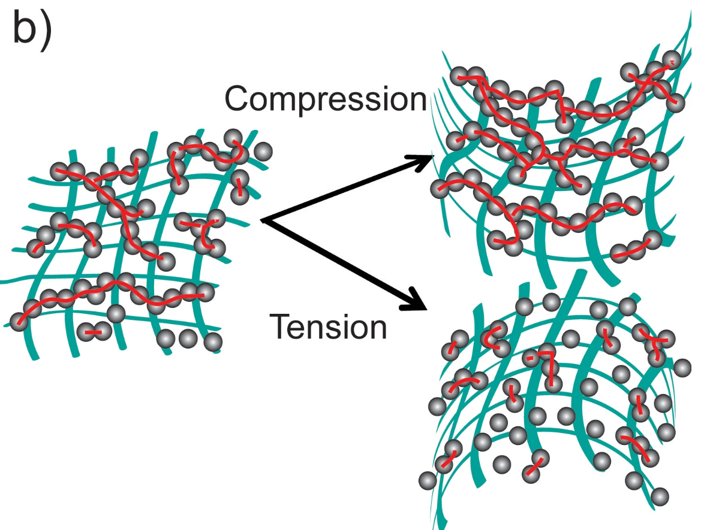
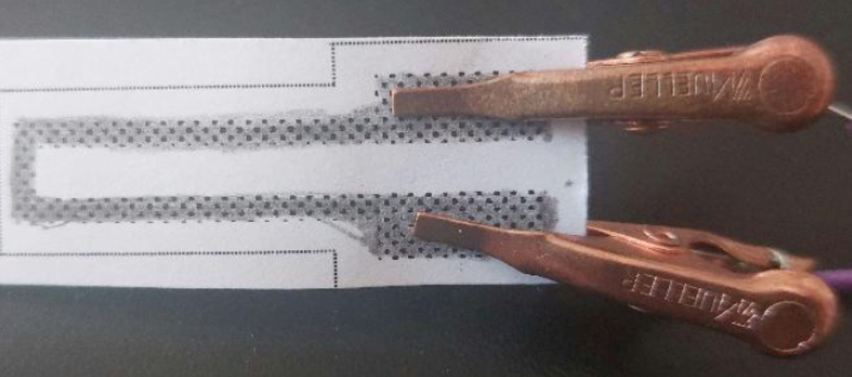
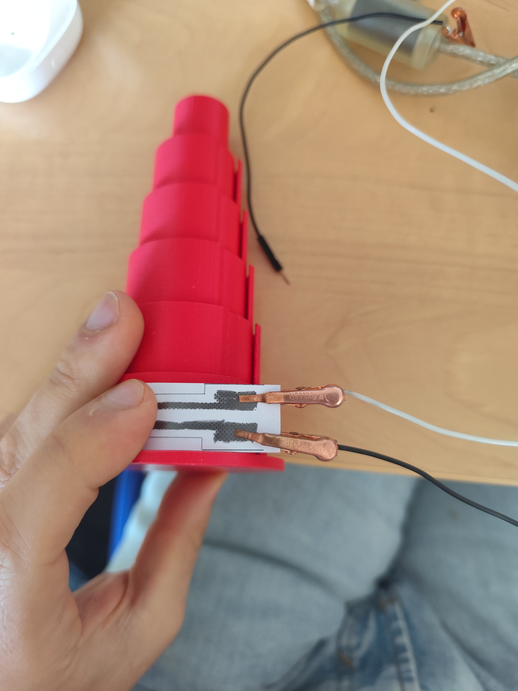
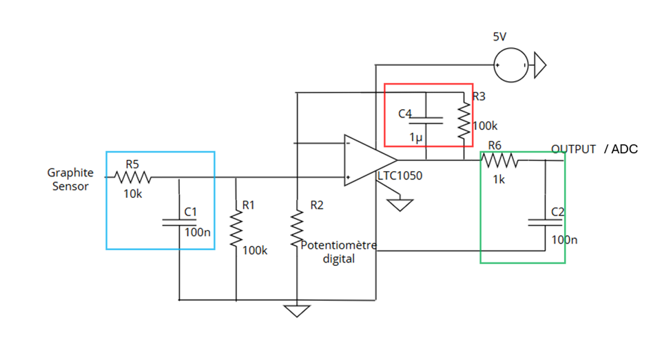
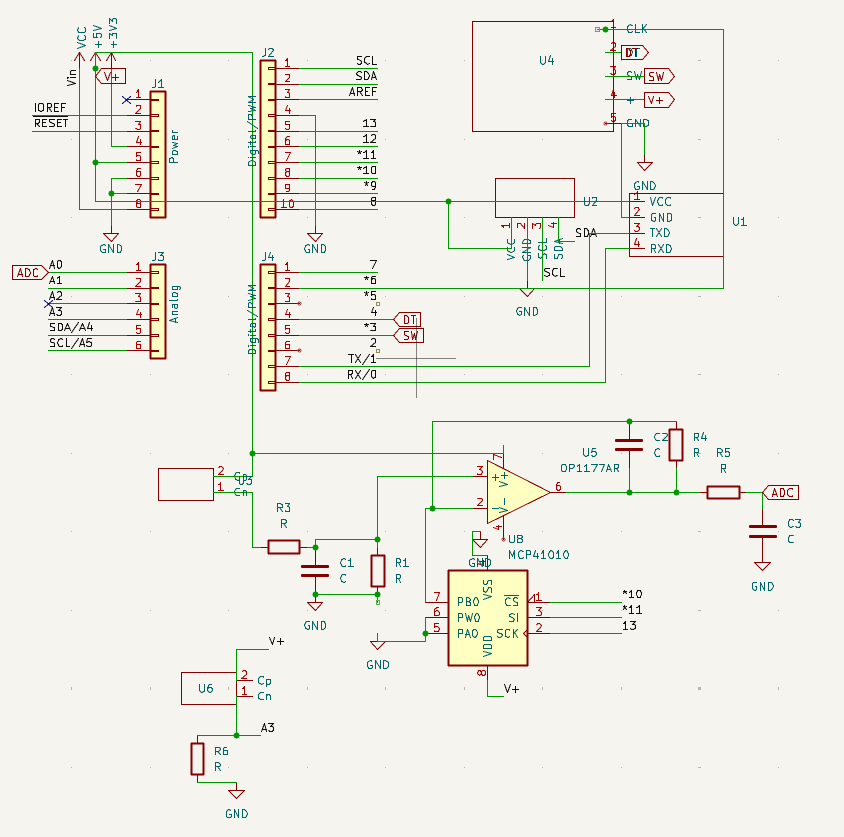
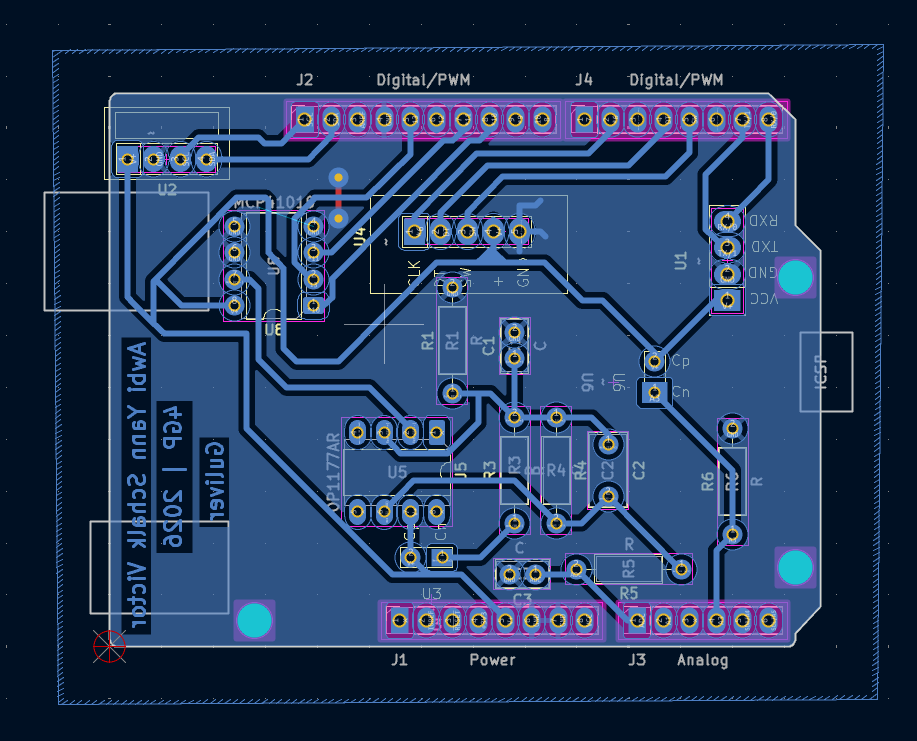
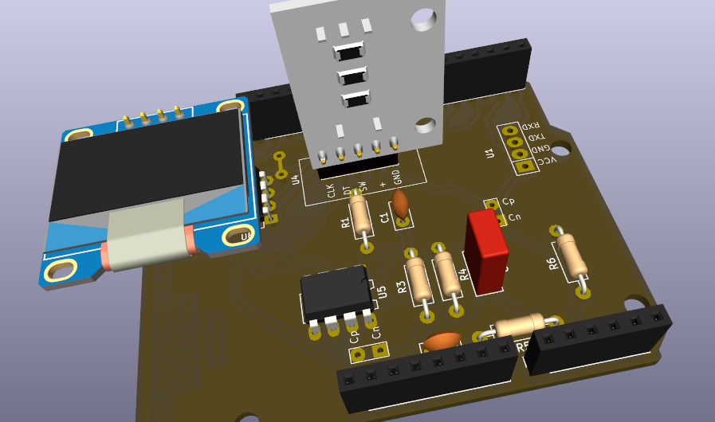
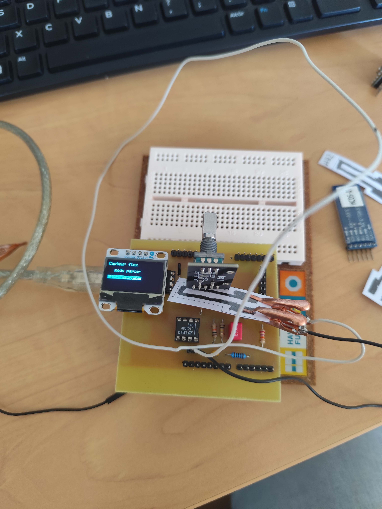
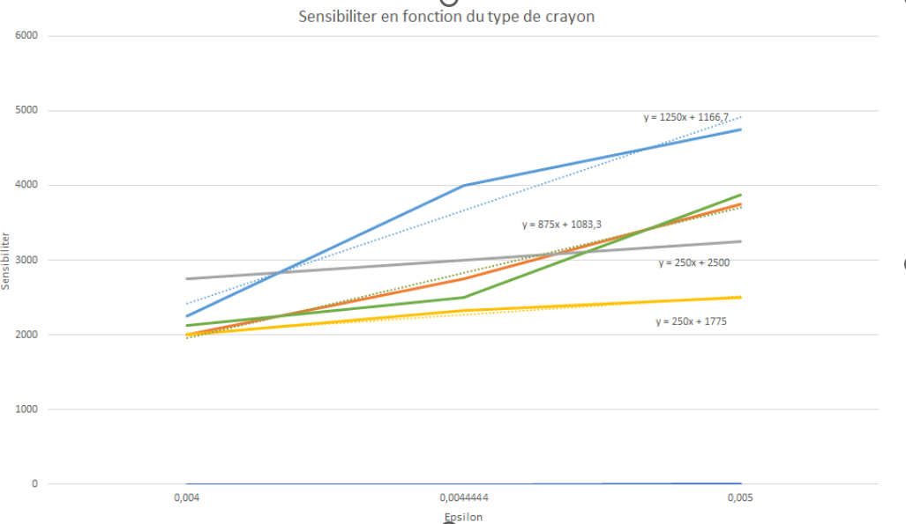

# Low Tech Graphite Strain Sensor — LTGSS-2025

**Yann A. & Victor S. — INSA Toulouse**  
4GP — 2025/2026

---

## Partie I : Contexte

Le but de ce projet est de réaliser un capteur de déformation (strain gauge) low-tech à base de graphite déposé au crayon sur une feuille de papier. L'origine du projet s'appuie sur les travaux de *Lin, CW, Zhao, Z., Kim, J. et al.* publiés dans *Nature* (2014) : **"Pencil Drawn Strain Gauges and Chemiresistors on Paper"**.

Le principe est le suivant : le capteur est un système granulaire dont la conductance dépend de la distance inter-grain de graphite. En compression, les grains se rapprochent et la conductance augmente ; en tension, ils s'éloignent et la résistance augmente. En mesurant la résistance du capteur, on peut déduire l'état de déformation de la structure.

Notre travail consiste à réaliser le capteur, le circuit électronique de lecture et à le tester afin de le comparer aux spécifications d'une jauge industrielle.

*Figure I.1 – Principe de fonctionnement du capteur granulaire en compression et en tension*

---

## Partie I.1 : Liste des livrables

1. Un shield PCB pour Arduino UNO permettant la mesure de résistance du capteur graphite
2. Le schématique et les fichiers KiCad du shield
3. La datasheet du capteur (LTGSS-2025)
4. La caractérisation du capteur (sensibilité en fonction du type de crayon)

---

## Partie I.2 : Liste du matériel

**Capteur graphite**
- Feuille de papier (épaisseur ~0.35 mm)
- Crayons à papier : H à 3B (testé B, 2B, 3B, 4B)

**Arduino et modules**
- Carte Arduino UNO + câble USB
- Module Bluetooth HC-05
- Écran OLED
- Encodeur rotatoire

**Circuit amplificateur**
- Amplificateur opérationnel LTC1050 (chopper-stabilisé)
- Potentiomètre digital MCP41010 (0 à 10 kΩ)
- Condensateurs : 2× 100 nF + 1× 1 µF
- Résistances : R1 = 100 kΩ, R3 = 100 kΩ, R5 = 10 kΩ, R6 = 1 kΩ

**Matériel PCB**
- Plaque d'époxy cuivrée
- Machine UV + révélateur + perchlorure de fer

---

## Partie II : Capteur graphite

Le capteur est fabriqué en déposant une couche de graphite au crayon à papier sur un gabarit imprimé. Les connexions électriques sont assurées par des pinces crocodile.

*Figure II.1 – Capteur graphite avec connexions*

*Figure II.2 – Capteur appliqué sur le banc de test (rayon de courbure contrôlé)*

### Spécifications électriques

| Paramètre | Valeur |
|---|---|
| Type | Capteur passif à base de graphène |
| Matériau | Graphite (crayon à papier) |
| Dimensions | 3 × 1.5 cm² — Épaisseur : 0.2 mm |
| Plage de température | 10 à 35 °C |
| Alimentation max. | 5 V (Arduino) |

**Résistance du capteur (en MΩ) selon le type de crayon :**

| Crayon | Min (compression) | Typ | Max (flexion) |
|---|---|---|---|
| 4B | — | — | 140 MΩ |
| 3B | 290 MΩ | 350 MΩ | 550 MΩ |
| 2B | 240 MΩ | 280 MΩ | 350 MΩ |
| B  | 300 MΩ | 340 MΩ | 480 MΩ |

---

## Partie III : Circuit amplificateur

La résistance du capteur étant de l'ordre du mégaohm, le courant en sortie est très faible. Un amplificateur transimpédance est utilisé pour convertir ce courant en tension lisible par le convertisseur analogique-numérique de l'Arduino.

*Figure III.1 – Schéma du circuit amplificateur (LTC1050 + MCP41010)*

Le LTC1050 est un AOP chopper-stabilisé. Le potentiomètre digital MCP41010 règle le gain R2 (0 à 10 kΩ), ce qui permet de centrer automatiquement la tension de sortie autour de 2.5 V.

La résistance du capteur se calcule à partir de la tension ADC :

$$R_{sensor} = \left(1 + \frac{R3}{R2}\right) R1 \cdot \frac{V_{cc}}{V_{adc}} - R1 - R5$$

**Valeurs des composants :**
- R1 = 100 kΩ (résistance de référence)
- R2 = MCP41010 (0 à 10 kΩ, potentiomètre digital)
- R3 = 100 kΩ (résistance de feedback)
- R5 = 10 kΩ (résistance série en entrée)
- R6 = 1 kΩ (résistance de sortie)
- C1 = C2 = 100 nF (condensateurs de découplage)
- C4 = 1 µF (découplage alimentation)
- Vcc = 5 V

---

## Partie IV : PCB sous KiCad

Une fois le circuit validé, le shield a été conçu sous KiCad. Les composants non disponibles dans la bibliothèque standard ont nécessité la création de symboles et d'empreintes personnalisées (module Bluetooth HC-05, écran OLED, encodeur rotatoire, capteur graphite).

### Schématique

*Figure IV.1 – Schématique complet du shield sous KiCad*

### Routage PCB

*Figure IV.2 – Vue du routage du PCB sous KiCad*

### Modélisation 3D

*Figure IV.3 – Modélisation 3D du shield*

---

## Partie V : Fabrication et tests

Après validation du design KiCad, le PCB a été fabriqué en salle de TP (insolation UV, révélateur, bain de perchlorure de fer, perçage et soudure).

*Figure V.1 – PCB assemblé avec l'écran OLED, l'encodeur et le LTC1050*

---

## Partie VI : Caractérisation

La sensibilité du capteur a été mesurée sur un banc de test à rayons de courbure connus. Les résultats montrent que la sensibilité est plus élevée pour les crayons plus gras (4B > 3B > 2B > B), bien que la répétabilité soit meilleure avec les crayons plus gras.

*Figure VI.1 – Sensibilité (ΔR/R₀) en fonction de la déformation ε selon le type de crayon*

**Équations de sensibilité linéaire (ajustement) :**
- 4B : y = 1250x + 1166.7
- 3B : y = 875x + 1083.3
- 2B : y = 250x + 2500
- B  : y = 250x + 1775

---

## Contacts

Yann A. — INSA Toulouse — 4GP 2025/2026  
Victor S. — INSA Toulouse — 4GP 2025/2026
